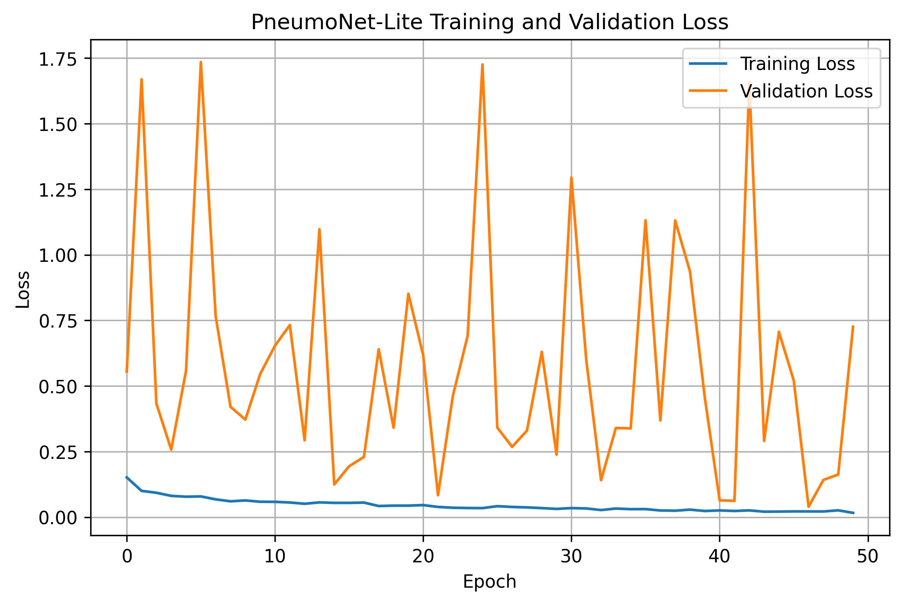
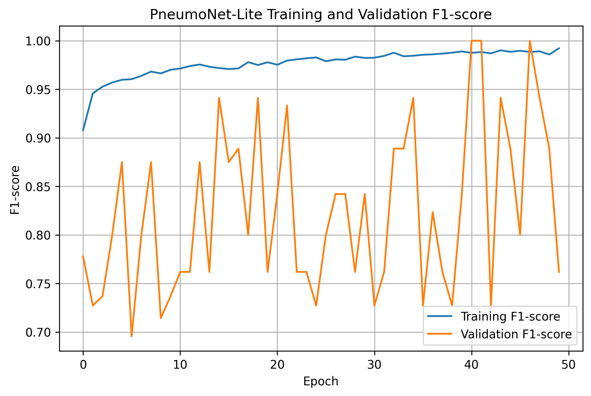
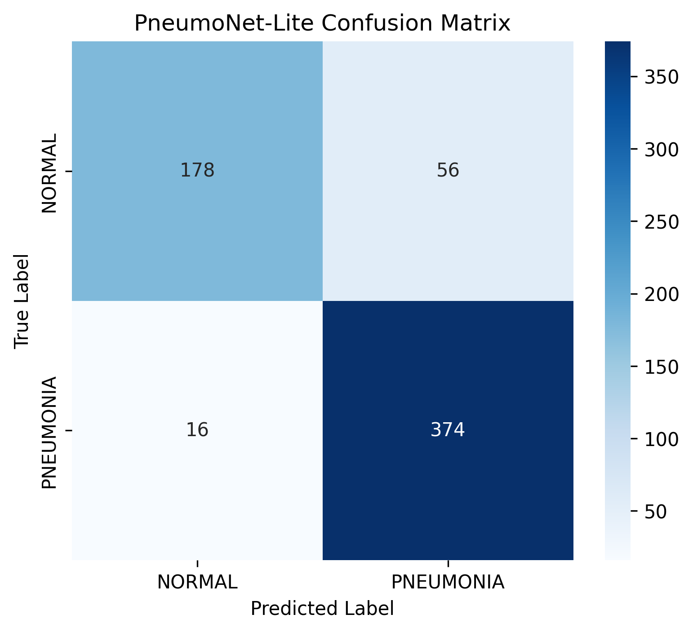

# Chest X-Ray Pneumonia Classification: ResNet50 Baseline vs PneumoNet-Lite Custom CNN


## Overview

This project presents a comparative study of deep learning-based approaches for chest X-ray pneumonia classification.

The study evaluates two convolutional neural network approaches:

1. **ResNet50 Transfer Learning (Baseline Model)**
2. **PneumoNet-Lite Custom CNN (Proposed Lightweight Architecture)**

The objective of this research project is to investigate whether a lightweight custom convolutional neural network can achieve competitive classification performance while significantly reducing model complexity compared with a larger pretrained architecture.

The models classify chest X-ray images into two categories:

- NORMAL
- PNEUMONIA


---

# Research Objective

The main research question explored in this project is:

> Can a lightweight custom CNN architecture achieve competitive pneumonia classification performance while using significantly fewer parameters than a ResNet50 transfer learning model?

The project focuses on:

- Chest X-ray image classification
- CNN architecture development
- Transfer learning comparison
- Model efficiency analysis
- Medical image classification evaluation


---

# Dataset

This project uses the publicly available **Chest X-Ray Images (Pneumonia) Dataset** from Kaggle.

Dataset Source:

https://www.kaggle.com/datasets/paultimothymooney/chest-xray-pneumonia

The dataset contains two image classes:

| Class | Description |
|---|---|
| NORMAL | Chest X-ray images without pneumonia |
| PNEUMONIA | Chest X-ray images showing pneumonia |

Dataset distribution used in this project:

| Dataset Split | Number of Images |
|---|---:|
| Training | 5216 |
| Validation | 16 |
| Testing | 624 |


---

# Project Structure

```
chest-xray-pneumonia-detection/

│
├── notebooks/
│   │
│   ├── resnet50_baseline_experiment.ipynb
│   └── pneumonet_lite_custom_cnn.ipynb
│
├── models/
│   │
│   ├── pneumonet_lite_final.pth
│   └── README.md
│
├── results/
│   │
│   ├── resnet50_baseline/
│   │
│   └── pneumonet_lite/
│
├── requirements.txt
│
├── README.md
│
└── LICENSE
```

---

# Experimental Methodology

The project was conducted in two experimental stages.

## Experiment 1: ResNet50 Transfer Learning Baseline

ResNet50 was selected as the baseline architecture due to its established performance in image classification tasks.

The pretrained ImageNet model was adapted for binary pneumonia classification.

### Model Details

- Architecture: ResNet50
- Approach: Transfer Learning
- Pretrained Backbone: ImageNet
- Classification Task: Binary Classification
- Classes:
  - NORMAL
  - PNEUMONIA


---

## Experiment 2: PneumoNet-Lite Custom CNN

PneumoNet-Lite is a lightweight custom convolutional neural network developed for chest X-ray pneumonia classification.

The objective of designing this architecture was to evaluate whether a smaller CNN can achieve strong classification performance with reduced computational complexity.

### Architecture Components

The proposed architecture includes:

- Four convolutional feature extraction blocks
- Batch normalization
- ReLU activation
- Max pooling layers
- Global average pooling
- Dropout regularization
- Fully connected classifier


Architecture workflow:

```
Input Chest X-Ray Image

          ↓

Convolutional Feature Extraction

          ↓

Feature Representation

          ↓

Global Average Pooling

          ↓

Fully Connected Classifier

          ↓

NORMAL / PNEUMONIA Prediction
```

---

# Training Configuration

Both experiments were evaluated under comparable settings.

| Parameter | Value |
|---|---|
| Image Size | 224 × 224 |
| Batch Size | 32 |
| Optimizer | Adam |
| Loss Function | Weighted Binary Cross Entropy |
| Epochs | 50 |
| Evaluation Metrics | Accuracy, Precision, Recall, F1-score |


---

# Experimental Results

## ResNet50 vs PneumoNet-Lite Comparison

| Model | Parameters | Accuracy | Precision | Recall | F1-score |
|---|---:|---:|---:|---:|---:|
| ResNet50 Transfer Learning | ~23.5M | 79.97% | 75.73% | 100% | 86.19% |
| PneumoNet-Lite Custom CNN | 1.2M | 88.46% | 86.98% | 95.90% | 91.22% |


---

# Key Findings

The comparative analysis demonstrated:

- PneumoNet-Lite achieved higher test accuracy compared with the ResNet50 baseline.
- PneumoNet-Lite achieved a higher F1-score while using significantly fewer parameters.
- The proposed model contains approximately **1.2 million parameters**, compared with approximately **23.5 million parameters** in ResNet50.
- The lightweight architecture provides an improved balance between classification performance and computational efficiency.


---

# PneumoNet-Lite Results Visualization

## Training and Validation Loss




## Training and Validation F1-score




## Confusion Matrix




---

# Results and Artifacts

The repository contains experimental outputs from both models.

```
results/

├── resnet50_baseline/

│   ├── confusion_matrix.png
│   ├── training_validation_loss.png
│   ├── training_validation_f1.png
│   └── model_experiment_comparison.csv


└── pneumonet_lite/

    ├── pneumonet_lite_confusion_matrix.png
    ├── pneumonet_lite_training_validation_loss.png
    ├── pneumonet_lite_training_validation_f1.png
    ├── pneumonet_lite_test_metrics.csv
    └── resnet50_vs_pneumonet_comparison.csv
```

---

# Model Weights

Due to GitHub file size limitations, large model files are documented separately.

Model access information is available in:

```
models/README.md
```

Available models:

- PneumoNet-Lite:
  - Included in repository

- ResNet50:
  - Hosted externally due to file size limitations


---

# Installation and Usage

## Clone Repository

```bash
git clone https://github.com/habibaume2007-creator/chest-xray-pneumonia-detection
```

## Install Dependencies

```bash
pip install -r requirements.txt
```

## Run Experiments

Open the notebooks:

```
notebooks/

resnet50_baseline_experiment.ipynb

pneumonet_lite_custom_cnn.ipynb
```

---

# Limitations

This project has several limitations:

- The validation subset contains only 16 images, which can cause fluctuations in validation metrics.
- Experiments were performed using a single dataset.
- External clinical validation was not performed.
- The models are intended for research purposes and not clinical deployment.


---

# Future Work

Future improvements include:

- Testing on larger medical imaging datasets
- Applying explainable AI techniques such as Grad-CAM
- Exploring attention-based architectures
- Performing cross-dataset validation
- Developing optimized lightweight models for healthcare applications


---

# Dataset Reference

Kermany, D. S., Goldbaum, M., Cai, W., et al. (2018).  
Identifying Medical Diagnoses and Treatable Diseases by Image-Based Deep Learning.  
Cell, 172(5), 1122–1131.


---

# Author

**Um e Habiba**

Computer Vision Research Project  
Chest X-Ray Pneumonia Classification  
July 2026


GitHub:

https://github.com/habibaume2007-creator


---

# License

This project is licensed under the MIT License.
